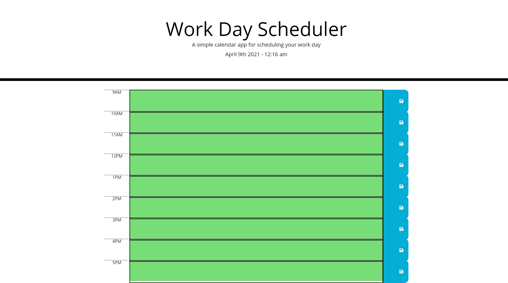

# 05-day-planner JH
by Jacob Hegan - Full Stack Web Development Bootcamp 2021

[GitHub Repository](https://github.com/heganjr/05-day-planner-JH)

[GitHub Deployment Link](https://heganjr.github.io/05-day-planner-JH/)

---

## The Task
- GIVEN I am using a daily planner to create a schedule
- WHEN I open the planner
- THEN the current day is displayed at the top of the calendar
- WHEN I scroll down
- THEN I am presented with timeblocks for standard business hours
- WHEN I view the timeblocks for that day
- THEN each timeblock is color coded to indicate whether it is in the past, present, or future
- WHEN I click into a timeblock
- THEN I can enter an event
- WHEN I click the save button for that timeblock
- THEN the text for that event is saved in local storage
- WHEN I refresh the page
- THEN the saved events persist

---

The user is able to use this daily planner to save their information in the text area fields within each timeblock row. From this localStorage setItem is used when the save icon is clicked and is retrieved through getItem on the page's refresh.

Basted on the user's device's time a function is used to colour code the timeblock's (Grey = Past; Red = Present; Green = Future)

The day planner satisfies the acceptance criteria based on the user's story

## Screenshot

#### END